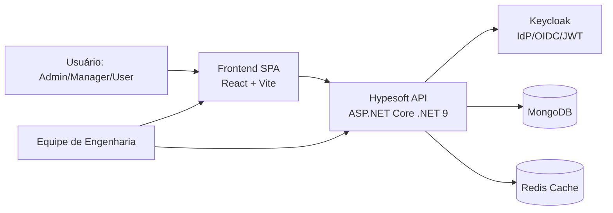
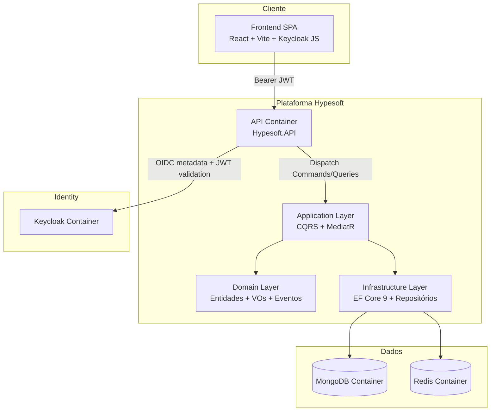

# Hypesoft Challenge — README Enterprise

## 1) Visão Geral do Sistema
A solução Hypesoft é uma plataforma de e-commerce com frontend React/Vite e backend .NET 9, estruturada para evolução segura em cenários corporativos. O backend implementa Clean Architecture + DDD + CQRS com autenticação/autorização via Keycloak (JWT), observabilidade com Serilog e hardening de segurança no pipeline HTTP.

### Objetivos de engenharia atendidos
- Isolamento de regras de negócio no domínio.
- Escalabilidade lógica via separação de leitura/escrita (CQRS).
- Segurança enterprise (RBAC, rate limiting, security headers, health checks dependentes).
- Operação local e CI/CD simplificadas com Docker Compose.

---

## 2) Arquitetura (Clean Architecture + CQRS + DDD)

### Camadas
- **Hypesoft.Domain**: entidades, value objects, eventos de domínio e contratos.
- **Hypesoft.Application**: casos de uso (Commands/Queries), validações, DTOs, handlers MediatR.
- **Hypesoft.Infrastructure**: EF Core 9 (provider MongoDB), persistência, repositórios e integrações externas.
- **Hypesoft.API**: controllers REST, autenticação JWT, middlewares, composição de DI e políticas.

### Padrões arquiteturais aplicados
- **Clean Architecture** para dependências apontando para o centro (Domain/Application).
- **DDD** para modelagem de regras críticas (ex.: estoque baixo e invariantes de produto).
- **CQRS** para separar operações de comando e consulta.
- **MediatR** para desacoplamento entre API e aplicação, com pipeline de validação.

---

## 3) Diagrama C4 (Contexto e Container em Mermaid)

### C4 — Nível Contexto


### C4 — Nível Container


---

## 4) Justificativa técnica das decisões

### EF Core 9 + MongoDB
- Mantém produtividade do ecossistema .NET com provider orientado a documentos.
- Preserva consistência de modelagem no domínio sem acoplamento a SQL relacional.
- Facilita evolução de esquema para casos de catálogo e produto com alta variabilidade.

### CQRS
- Separa caminhos de escrita (com validação/invariantes) dos de leitura (consulta/paginação/estatísticas).
- Reduz complexidade em handlers e melhora testabilidade por caso de uso.

### MediatR
- Remove acoplamento controller ↔ serviço concreto.
- Permite pipeline transversal (ex.: validação FluentValidation) sem poluir controllers.

### Keycloak
- Centraliza identidade, papéis e emissão de JWT com padrão OIDC.
- Suporta RBAC por políticas (`Admin`, `Manager`, `User`) com auditoria e governança.

### Docker Compose
- Orquestra stack completa (frontend, backend, MongoDB, Redis, Keycloak) com bootstrap rápido.
- Uniformiza ambiente de desenvolvimento/validação e reduz diferença entre máquinas.

---

## 5) ADRs (Architecture Decision Records)

### ADR-001 — Padrão arquitetural Clean Architecture + DDD + CQRS
- **Status**: Accepted
- **Contexto**: necessidade de evolução contínua com regras de negócio explícitas.
- **Decisão**: separar domínio, aplicação, infraestrutura e API com comandos/consultas independentes.
- **Consequências**: maior disciplina de fronteiras e manutenção simplificada em médio/longo prazo.

### ADR-002 — Identity Provider externo com Keycloak
- **Status**: Accepted
- **Contexto**: requisitos de autenticação corporativa e RBAC.
- **Decisão**: usar Keycloak com JWT Bearer e validação OIDC.
- **Consequências**: desacoplamento da autenticação da aplicação e administração centralizada de usuários/roles.

### ADR-003 — Persistência principal em MongoDB via EF Core 9
- **Status**: Accepted
- **Contexto**: domínio de catálogo e necessidade de flexibilidade de estrutura.
- **Decisão**: persistir entidades no MongoDB mantendo abstrações do EF Core.
- **Consequências**: desenvolvimento rápido e modelagem documental; atenção a consultas complexas e índices.

### ADR-004 — Middlewares de hardening no pipeline HTTP
- **Status**: Accepted
- **Contexto**: requisito enterprise de segurança operacional.
- **Decisão**: aplicar rate limiting por IP, security headers, correlation-id, gzip e tratamento global de exceções.
- **Consequências**: maior proteção contra abuso e melhor rastreabilidade em incidentes.

### ADR-005 — Ambiente local unificado com Docker Compose
- **Status**: Accepted
- **Contexto**: necessidade de execução fim a fim reproduzível.
- **Decisão**: subir toda a stack por `docker-compose` com variáveis em `.env`.
- **Consequências**: onboarding acelerado e validação técnica consistente.

---

## 6) Instruções de execução

### Pré-requisitos
- Docker Desktop
- .NET SDK 9
- Node.js 20+
- PowerShell 5.1+

### Opção A — Stack completa via Docker
```powershell
# Na raiz do repositório
 docker-compose up -d --build

# Verificar containers
 docker-compose ps

# API
# http://localhost:5000

# Frontend
# http://localhost:3000

# Keycloak
# http://localhost:8080
```

### Opção B — Execução local (sem containerizar app)
```powershell
# Infra (Mongo, Redis, Keycloak)
 docker-compose up -d mongodb redis keycloak

# Backend
 dotnet restore .\backend\src\Hypesoft.API\Hypesoft.API.csproj
 dotnet run --project .\backend\src\Hypesoft.API\Hypesoft.API.csproj

# Frontend
 cd .\frontend
 pnpm install
 pnpm dev
```

---

## 7) Estrutura de pastas explicada

```text
.
├── backend/
│   ├── src/
│   │   ├── Hypesoft.API/            # Entrada HTTP, autenticação, middlewares e composição
│   │   ├── Hypesoft.Application/    # Commands/Queries, DTOs, handlers, validação
│   │   ├── Hypesoft.Domain/         # Regras de negócio puras e modelos do domínio
│   │   └── Hypesoft.Infrastructure/ # Persistência, repositórios, integrações externas
│   └── tests/Hypesoft.Tests/        # Projeto de testes backend (base para expansão)
├── frontend/                        # SPA React/Vite, UI dashboard, testes de frontend
├── keycloak/                        # Realm export/import e configuração de identidade
├── nginx/                           # Configuração de reverse proxy/deploy estático
├── docker-compose.yml               # Orquestração de containers
└── validate-enterprise.ps1          # Suíte de validação enterprise ponta a ponta
```

---

## 8) Estratégia de testes

### Pirâmide de testes proposta
- **Unitários (Domain/Application)**: invariantes de entidades, validadores e handlers.
- **Integração (API + Infra)**: fluxo autenticado por role, regras de negócio e persistência.
- **Contrato/Smoke**: health check e endpoints críticos.
- **E2E técnico**: script `validate-enterprise.ps1` para critérios funcionais e não funcionais.

### Estado atual
- Existe suíte enterprise automatizada (`validate-enterprise.ps1`) validando autenticação, regras de negócio, paginação, performance e segurança.
- Projeto backend de testes está criado e pronto para expansão incremental.

---

## 9) Estratégia de segurança

### Controles implementados
- **Autenticação/Autorização**: JWT Bearer + Keycloak, políticas por role (`Admin`, `Manager`, `User`).
- **Rate limiting global por IP**: proteção contra abuso (default `100 req/min`).
- **Security headers**: `X-Content-Type-Options`, `X-Frame-Options`, `Referrer-Policy`, `Content-Security-Policy`.
- **Correlation ID**: rastreabilidade ponta a ponta via `X-Correlation-ID`.
- **Tratamento global de exceções**: sem exposição de stack trace ao cliente.
- **CORS restrito**: origens explicitamente configuradas no `appsettings`.
- **HTTPS redirection configurável**: habilitável por ambiente.
- **Logging de falhas JWT**: eventos de challenge/forbidden/authentication failed.

### Controles operacionais recomendados
- Rotação periódica de segredos e credenciais do `.env`.
- TLS obrigatório em produção e ajuste de CSP por domínio real.
- Hardening de Redis/Mongo (auth, network policy, backup e retenção).

---

## 10) Estratégia de performance

- **CQRS** reduz overhead de escrita/leitura acoplada.
- **Paginação** em listagens evita carga excessiva por request.
- **Gzip response compression** reduz payload de resposta.
- **Redis** disponível para caching de consultas de alta repetição.
- **Rate limiting** protege capacidade sob picos.
- **Métrica operacional do desafio**: requests críticos abaixo de `500ms` (validado pela suíte).

---

## 11) Checklist de critérios atendidos da Hypesoft

| Critério | Status | Evidência técnica |
|---|---|---|
| Clean Architecture + DDD + CQRS | ✅ | Separação em `Domain/Application/Infrastructure/API` |
| JWT com Keycloak e RBAC | ✅ | Policies `Admin/Manager/User` e validação token |
| Validação de entrada (400) | ✅ | Pipeline de validação + middleware global |
| Regras de negócio (low-stock `< 10`) | ✅ | Endpoint `GET /api/products/low-stock?threshold=10` + asserções |
| Dashboard de estatísticas | ✅ | Endpoint `GET /api/dashboard/stats` |
| Paginação de produtos | ✅ | `GET /api/products?pageNumber=1&pageSize=1` |
| Segurança de transporte/aplicação | ✅ | CORS, headers, rate limiting, correlation-id |
| Performance crítica | ✅ | Validação automatizada com limite `<500ms` |
| Saúde de dependências | ✅ | `MapHealthChecks("/health")` com Mongo/Redis/OIDC |

---

## 12) Como rodar a suíte `validate-enterprise.ps1`

### Passo a passo
```powershell
# 1) Subir a stack
 docker-compose up -d --build

# 2) Executar validação enterprise
 powershell -ExecutionPolicy Bypass -File .\validate-enterprise.ps1

# 3) Verificar exit code (0 = GO; 1 = NO-GO)
 echo $LASTEXITCODE
```

### O que a suíte valida
- `Health` da aplicação.
- Acesso anônimo bloqueado (`401`) em endpoints protegidos.
- Login Keycloak para `admin`, `manager`, `user`.
- Matriz de autorização por role (`200/201/403` esperados).
- Validação de payload inválido (`400`).
- Regra de low-stock e consistência com dashboard.
- Paginação correta.
- Performance dos cenários críticos (`<500ms`).
- Retorno do header `X-Correlation-ID`.

---

## 13) Exemplos de requisições

### 13.1 Obter token no Keycloak (password grant para validação técnica)
```bash
curl -X POST "http://localhost:8080/realms/hypesoft/protocol/openid-connect/token" \
  -H "Content-Type: application/x-www-form-urlencoded" \
  -d "client_id=hypesoft-frontend" \
  -d "grant_type=password" \
  -d "username=admin" \
  -d "password=admin123"
```

### 13.2 Listar produtos (autenticado)
```bash
curl "http://localhost:5000/api/products?pageNumber=1&pageSize=5" \
  -H "Authorization: Bearer <TOKEN>" \
  -H "X-Correlation-ID: 123e4567-e89b-12d3-a456-426614174000"
```

### 13.3 Criar produto (Manager/Admin)
```bash
curl -X POST "http://localhost:5000/api/products" \
  -H "Authorization: Bearer <TOKEN_MANAGER_OU_ADMIN>" \
  -H "Content-Type: application/json" \
  -d '{
    "name": "Notebook Pro",
    "description": "16GB RAM",
    "price": 8999.90,
    "stockQuantity": 7,
    "categoryId": "<CATEGORY_ID>"
  }'
```

### 13.4 Validar regra low-stock
```bash
curl "http://localhost:5000/api/products/low-stock?threshold=10" \
  -H "Authorization: Bearer <TOKEN>"
```

### 13.5 Health detalhado
```bash
curl "http://localhost:5000/health"
```

---

## 14) Print esperado dos resultados de validação

Saída consolidada esperada no terminal:

```text
========================
HYPESOFT ENTERPRISE VALIDATION
Validation: PASS
Auth: PASS
Business Rules: PASS
Performance: PASS
Security: PASS
Overall: GO
========================
```

Trecho esperado da tabela de resultados:

```text
Name                                 Group           Status ExpectedStatus DurationMs Passed Critical
----                                 -----           ------ ------------- ---------- ------ --------
Health check                         Validation      200    200           ...        True   True
Anonymous GET /api/products          Auth            401    401           ...        True   True
User POST /api/products (forbidden)  Auth            403    403           ...        True   True
Validation POST invalid product      Validation      400    400           ...        True   True
Performance assertion                Performance     200    200           <500       True   True
Correlation header assertion         Security        200    200           ...        True   True
```

> Critério de aceite da validação: `Overall: GO` e código de saída `0`.
